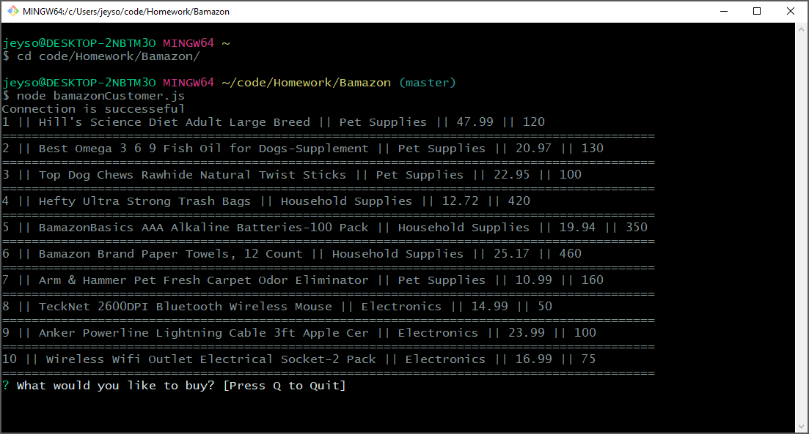
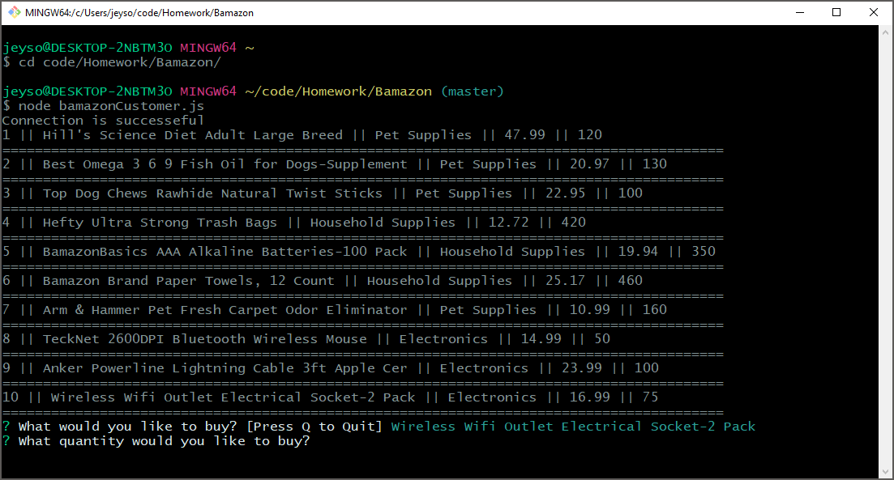
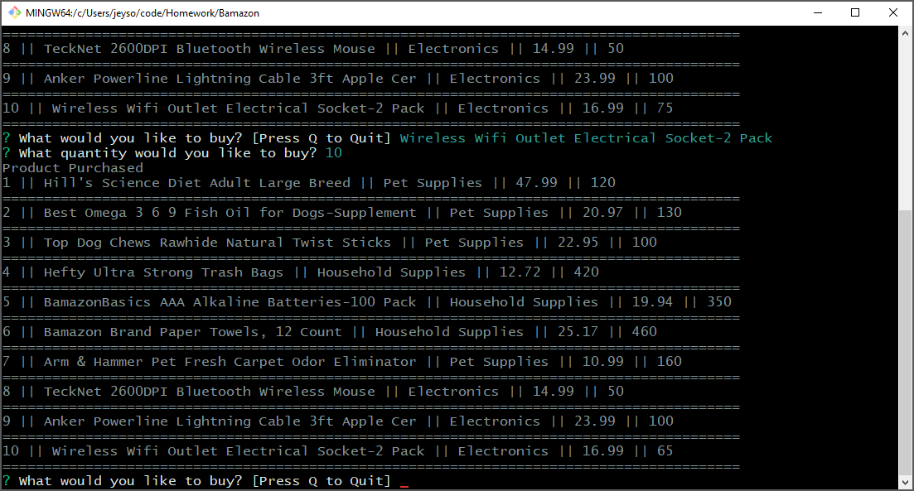

# bamazon

This is a node application to allow customer to place orders for products. 

The customer can:

* See a list of products offered from the database.
* Select which items they would like to buy.
* Select how many they would like to buy.

Once they have purchased items the database will update with the new amount availible in stock. 

## These applications must be installed and running to run the program.

1. Install Node.js (https://nodejs.org/en/download/)
2. Install MySql (https://www.mysql.com/downloads/) 
3. Install a MySQL developer tool such as MySQL Workbench (https://dev.mysql.com/downloads/workbench/).

###  Instructions

1. From the terminal, type "node bamazonCustomer.js" to start the program. You will be presented with a table of items availible in the Bamazon store. You will also be prompted with the the question "What would you like to buy?"

2. Type the name full name of the item you would like to buy, and hit enter. (sorry for the long product names)

3. Currently there are 75 "Wifi Outlet Electrical Sockets" (item #10 in the table). Choose the number you would like to puchase and hit enter. I typed "10" for this example. Immediately the table is revised to show that there are now 65 Wifi outlets left.

